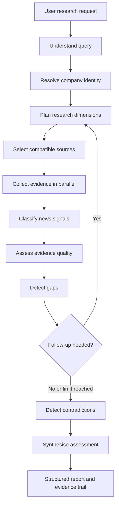

# UK Company Due Diligence and Risk Intelligence

An evidence-driven, agentic research application for UK company due diligence
and insurance underwriting pre-screening.

The system resolves a company, plans the required research, collects evidence
from official and public sources, checks evidence quality, follows up on gaps,
detects contradictions, and returns a structured underwriting assessment with
an evidence trail.

This is a research framework, not an autonomous underwriting authority. Final
risk acceptance remains with an authorised human reviewer.

## What It Produces

- Canonical company identity and Companies House number
- Company, officer, filing, regulatory, news, fraud, and ownership summaries
- Five-part risk matrix
- Company-specific risk flags with supporting evidence
- Sanctions, disqualification, phoenix-company, enforcement, and PSC findings
- Referral triggers, possible exclusions, loading indicators, and decline indicators
- Missing dimensions, contradictions, research iterations, and evidence trace

## Research Flow



The graph is implemented with LangGraph. Agent outputs are validated with
Pydantic models, and connector failures are represented as missing evidence
instead of terminating the complete research run.

## Research Dimensions

| Dimension | Primary evidence |
|---|---|
| Company profile | Companies House company record |
| Officers | Companies House officer register |
| Filing history | Companies House filing history |
| Regulatory status | FCA Financial Services Register |
| News signals | Brave Search candidates classified by an LLM |
| Web evidence | Supplementary Brave Search results |
| Fraud signals | Director disqualification, appointment history, OpenSanctions |
| Beneficial ownership | Companies House PSC register and OpenSanctions |

## Technology

- Python 3.10+
- LangGraph and LangChain
- Pydantic v2
- FastAPI and Server-Sent Events
- OpenAI or Groq chat models
- Companies House, FCA Register, Brave Search, and OpenSanctions
- Pytest

## Quick Start

### 1. Create an environment

Windows:

```powershell
python -m venv .venv
.\.venv\Scripts\Activate.ps1
python -m pip install --upgrade pip
pip install -r requirements.txt
Copy-Item .env.example .env
```

macOS or Linux:

```bash
python -m venv .venv
source .venv/bin/activate
python -m pip install --upgrade pip
pip install -r requirements.txt
cp .env.example .env
```

### 2. Configure an LLM

Mock source data avoids external research API calls, but agent decisions still
require an LLM.

Groq example:

```ini
CHAT_MODEL_PROVIDER=groq
CHAT_MODEL=llama-3.3-70b-versatile
CHAT_MODEL_FAST=llama-3.1-8b-instant
GROQ_API_KEY=your_key
USE_MOCK_DATA=true
```

OpenAI example:

```ini
CHAT_MODEL_PROVIDER=openai
CHAT_MODEL=gpt-4o
CHAT_MODEL_FAST=gpt-4o-mini
OPENAI_API_KEY=your_key
USE_MOCK_DATA=true
```

### 3. Start the application

```bash
python api_server.py
```

Open [http://localhost:8000](http://localhost:8000).

API documentation is available at
[http://localhost:8000/docs](http://localhost:8000/docs).

### 4. Run from the command line

```bash
python app.py --query "Create an underwriting assessment for Monzo Bank Limited"
```

## API

| Endpoint | Purpose |
|---|---|
| `GET /health` | Liveness check |
| `GET /` | Browser interface |
| `POST /research/sync` | Complete JSON response |
| `POST /research/stream` | SSE progress events and final assessment |
| `POST /research/chat` | Ask about an existing assessment without new research |
| `GET /docs` | OpenAPI interface |

Example synchronous request:

```bash
curl -X POST http://localhost:8000/research/sync \
  -H "Content-Type: application/json" \
  -d "{\"query\":\"Create a due diligence assessment for Monzo Bank Limited\"}"
```

## Live Data

The application starts with `USE_MOCK_DATA=true`. To use live sources:

1. Configure Companies House, Brave Search, and optional OpenSanctions keys.
2. Run `python scripts/check_apis.py`.
3. Set `USE_MOCK_DATA=false`.
4. Start a research request.

See [SETUP_REAL_APIS.md](SETUP_REAL_APIS.md) for source-specific instructions.

## Testing

Offline tests use mock evidence and do not call a real LLM:

```bash
python -m pytest -q -m "not eval"
```

Compile check:

```bash
python -m compileall -q src app.py api_server.py
```

LLM-backed evaluation uses mock source data but requires a configured model:

```bash
python scripts/run_eval.py
```

Run one evaluation case:

```bash
python scripts/run_eval.py monzo_full
```

## Configuration

| Variable | Default | Purpose |
|---|---|---|
| `CHAT_MODEL_PROVIDER` | `groq` in the example | LangChain model provider |
| `CHAT_MODEL` | Provider-specific | Quality-tier analytical model |
| `CHAT_MODEL_FAST` | Falls back to `CHAT_MODEL` | Faster planning/classification model |
| `USE_MOCK_DATA` | `true` | Use local source fixtures |
| `MAX_FOLLOWUP_ITERATIONS` | `2` | Maximum total research passes |
| `CONFIDENCE_THRESHOLD` | `0.6` | Guidance for evidence gap decisions |
| `CORS_ALLOWED_ORIGINS` | Local API origins | Comma-separated browser origins |
| `LANGCHAIN_TRACING_V2` | `false` | Enable optional LangSmith tracing |

All secrets are loaded through `src.config.settings`. Never commit `.env`.

## Project Structure

```text
src/
  agents/          LangGraph decision and analysis nodes
  connectors/      Raw API and mock-data access
  retrievers/      Source normalization into typed evidence
  api/             FastAPI application and endpoints
  evaluation/      Sample queries and structural validation
  graph.py         Workflow topology
  schemas.py       Pydantic contracts
  state.py         Shared AgentState
  prompts.py       Structured LLM instructions

frontend/          Browser interface
data/mock_sources/ Offline source fixtures
tests/             Offline unit and integration tests
scripts/           API checks and evaluation tools
docs/              Business and operational documentation
```

## Documentation

- [Business and functional guide](docs/BUSINESS_FUNCTIONAL_GUIDE.md)
- [Operational flow and system segregation](docs/OPERATIONAL_FLOW.md)
- [Live API setup](SETUP_REAL_APIS.md)

## Current Limitations

- Overall confidence is currently an LLM assessment, not a calibrated formula.
- Overall risk is not yet generated from an approved deterministic aggregation rule.
- Missing evidence can be difficult to distinguish from low risk in the risk matrix.
- Follow-up queries are planned, but targeted query text is not yet passed to retrievers.
- Entity resolution can continue when a company number is uncertain.
- The API has no authentication, rate limiting, or persistent case store.
- Public-source results and potential sanctions matches require human verification.

Do not use the output as a binding underwriting, legal, compliance, sanctions,
credit, or investment decision.

## AI Tool Stack

This project is part of [AI Tool Stack](https://www.ai-toolstack.com):
where AI demos become working systems.
