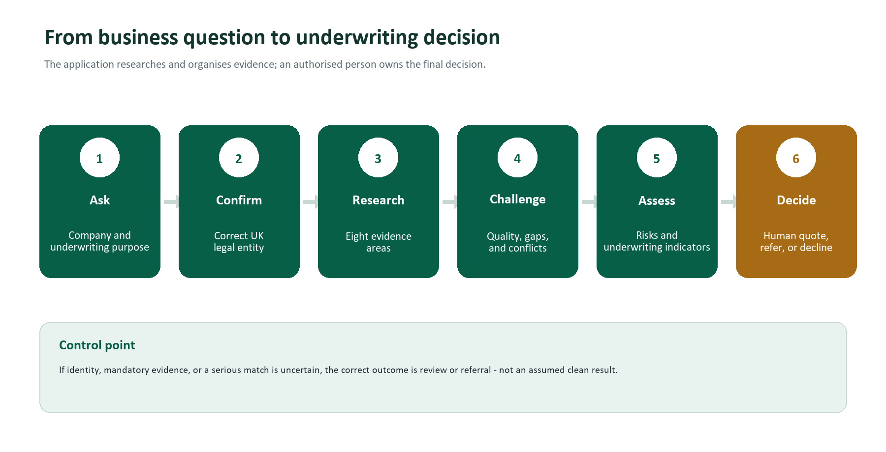
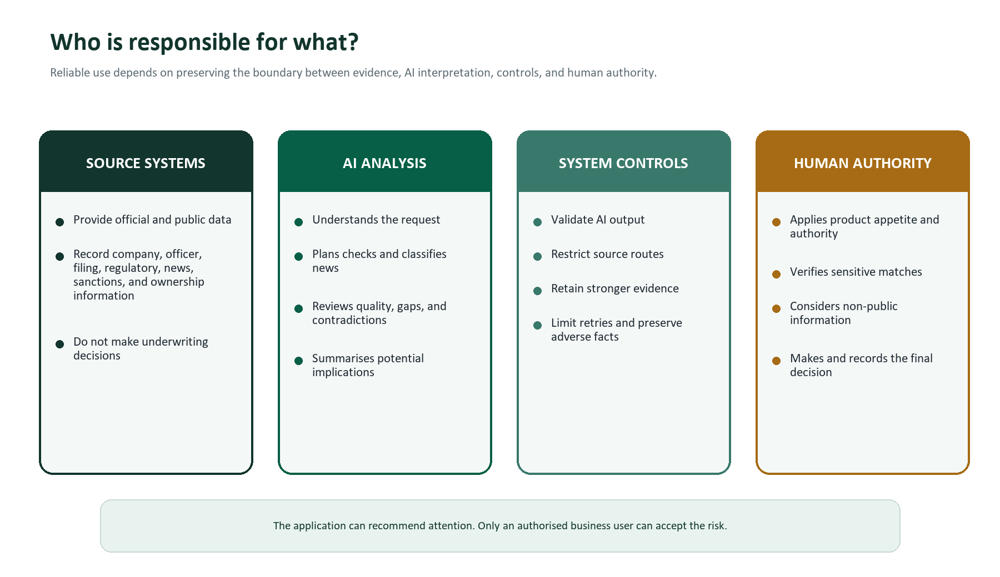

# UK Company Due Diligence and Risk Intelligence Application

## Business and Functional Guide

**Audience:** Insurance underwriters, underwriting managers, compliance and financial-crime SMEs, operations teams, product owners, business analysts, and governance stakeholders  
**Document date:** 14 June 2026  
**Document status:** Current-state functional guide with production recommendations

> **Purpose in one sentence:** The application gathers and reviews UK company information so that an underwriter can reach a faster, more consistent, and better-evidenced pre-screening decision.

## Executive summary

The application is an AI-assisted company due diligence service for UK insurance underwriting. A user enters a request in ordinary business language, such as "Assess Example Limited for D&O and Cyber underwriting." The application identifies the legal entity, plans the checks required, gathers evidence from official and public sources, reviews whether the evidence is complete, investigates gaps where possible, and produces a structured underwriting assessment.

The application is designed to support three practical business outcomes:

1. **Quote consideration:** The available evidence does not reveal a material reason to stop normal underwriting, subject to ordinary underwriting questions and authority limits.
2. **Human referral:** A finding, contradiction, missing critical check, or unusual circumstance requires an underwriter or specialist to review the case.
3. **Potential decline consideration:** A serious finding such as a confirmed sanctions issue, active disqualification concern, or critical fraud indicator may fall outside risk appetite.

The current application provides evidence, risk indicators, referral triggers, suggested exclusions, loading indicators, and decline indicators. It does **not** currently issue one authoritative quote, refer, or decline decision. The final decision remains with the authorised business user.

The application should therefore be understood as a **research and pre-screening assistant**, not as an autonomous underwriting authority.

<!-- PAGE BREAK -->

## 1. The business requirement

### 1.1 The problem being addressed

Company due diligence is often spread across several websites, internal searches, spreadsheets, emails, and individual judgement. An underwriter may need to:

- confirm the correct legal entity;
- review Companies House status and filings;
- identify current and former directors;
- confirm FCA status for regulated firms;
- search for enforcement, litigation, operational incidents, and adverse news;
- check sanctions, disqualification, phoenix-company, and ownership concerns;
- decide whether the evidence is complete enough to use;
- explain the decision and retain an audit trail.

This process is time-consuming and can vary between individuals. Important checks may be missed, repeated, or recorded inconsistently. A case may appear clean simply because a source was unavailable or because the search was too narrow.

### 1.2 The required business capability

The business requires a service that can:

- accept a plain-English company research request;
- identify the intended UK legal entity;
- determine which checks are relevant to the underwriting purpose;
- obtain evidence from appropriate sources;
- distinguish complete evidence from missing evidence;
- highlight adverse facts and contradictions;
- produce a consistent, reviewable underwriting summary;
- preserve the sources and evidence used;
- escalate uncertainty rather than conceal it.

### 1.3 Intended business value

| Business outcome | Expected value |
|---|---|
| Faster triage | Reduce the time spent moving between public registers and search tools |
| Consistent minimum checks | Apply a repeatable baseline across company reviews |
| Better referral quality | Give specialists a concise reason for referral and supporting evidence |
| Stronger auditability | Retain the evidence, source, retrieval time, and assessment rationale |
| Improved risk visibility | Bring governance, regulatory, fraud, ownership, and news signals together |
| Scalable operations | Allow more cases to be pre-screened without proportionally increasing manual research |

### 1.4 What is outside the current scope

The application does not currently:

- replace underwriting judgement or delegated authority;
- calculate premium or technical price;
- approve policy terms;
- confirm the legal accuracy of every third-party source;
- perform a complete legal, accounting, credit, or forensic investigation;
- guarantee that a person or company is not sanctioned;
- continuously monitor a company after the assessment;
- make a binding quote, refer, or decline decision;
- update internal policy administration or case-management systems.

## 2. Who uses the application

### 2.1 Primary users

**Underwriter**

Uses the assessment to understand the company, identify material concerns, decide what questions to ask, and determine whether the case can proceed or needs referral.

**Underwriting manager or referral authority**

Reviews high-risk findings, contradictions, proposed exclusions, loading indicators, and cases outside normal appetite.

**Compliance or financial-crime SME**

Reviews sanctions, politically exposed person concerns, beneficial ownership opacity, disqualified directors, and other financial-crime indicators.

**Risk engineer or specialist SME**

Reviews operational incidents, cyber events, governance concerns, sector-specific exposures, and evidence relevant to a specialist insurance line.

### 2.2 Supporting users

**Operations team**

Monitors failed searches, incomplete cases, turnaround time, and whether required checks were completed.

**Product owner or business analyst**

Defines business rules, risk appetite, workflow requirements, acceptance criteria, and future integrations.

**Model risk, audit, and governance teams**

Review how AI is used, whether decisions are explainable, whether evidence is retained, and where human approval is required.

## 3. The business journey

### Step 1: The user asks a business question

The user enters a request using the company name and purpose of the assessment.

Example:

> Assess Example Limited for D&O and Cyber underwriting. Include company status, directors, ownership, regulatory concerns, fraud indicators, and recent adverse news.

The user should not need to know source names or technical search syntax.

### Step 2: The application confirms the company

The application searches for the legal entity and attempts to identify:

- the official company name;
- Companies House number;
- FCA firm reference number, where relevant.

This is a critical control. Research about the wrong company is worse than no research.

### Step 3: The application plans the checks

The application interprets the purpose of the request and decides which research areas are required. A broad underwriting assessment should normally include all eight areas described in Section 4.

Fraud screening and beneficial ownership are treated as baseline checks. Regulatory checks are particularly important for banks, financial institutions, and FCA-regulated businesses.

### Step 4: Evidence is collected

The application obtains information from official registers and public sources. Independent searches are performed at the same time to reduce turnaround time.

Each result is stored with:

- the source;
- the type of check;
- the retrieval time;
- the underlying data;
- a short summary;
- an evidence-quality rating;
- a source-level confidence value.

### Step 5: Evidence is checked for quality and completeness

The application asks whether each required research area has enough usable evidence. It distinguishes:

- **high quality:** authoritative and sufficiently complete;
- **medium quality:** usable but incomplete or subject to caveats;
- **low quality:** thin, weak, or unreliable;
- **missing:** no usable evidence was obtained.

This step is important because "no adverse result found" is not the same as "the check was completed successfully."

### Step 6: Gaps may trigger another research pass

If an important check is missing or weak, the application may perform one targeted follow-up pass. Previous stronger evidence is retained so that a failed retry cannot erase a successful first result.

The number of passes is limited to control cost, latency, and repeated searches.

### Step 7: Conflicts are identified

The application compares information across sources and highlights contradictions, such as:

- a company described as active in one source but distressed or ceasing operations in another;
- director information that differs between official and regulatory records;
- an apparently clean company profile with adverse sanctions or fraud evidence;
- public ownership claims that do not align with the PSC register.

### Step 8: The application produces the assessment

The final report combines:

- company and registration summary;
- director and governance summary;
- filing and financial warning indicators;
- regulatory position;
- categorised news signals;
- fraud and sanctions findings;
- beneficial ownership concerns;
- a risk matrix;
- key risks;
- referral, exclusion, loading, and decline indicators;
- missing evidence and contradictions;
- confidence commentary;
- source evidence.

### Step 9: A human makes the business decision

The underwriter or authorised specialist reviews the findings in the context of:

- risk appetite;
- insurance product;
- limits and attachment points;
- claims experience;
- financial information not available to the application;
- proposal form answers;
- broker explanations;
- underwriting authority.

The application informs the decision. It does not replace accountability for the decision.

## 4. The eight due diligence checks

| Research area | Business question answered | Main source | Why it matters |
|---|---|---|---|
| Company profile | Is this the correct legal entity and is it active? | Companies House | Establishes identity, status, age, and legal form |
| Officers | Who manages the company and have there been notable changes? | Companies House | Supports governance and D&O assessment |
| Filing history | Is the company maintaining expected statutory filings? | Companies House | Late or unusual filings can indicate financial or governance concerns |
| Regulatory status | Is the firm authorised and subject to regulatory action? | FCA Register | Essential for regulated businesses and Financial Institutions underwriting |
| News signals | Are there recent material events or allegations? | Public web search | Identifies emerging events not yet visible in official registers |
| Web evidence | Is there useful supplementary public information? | Public web search | Supports or challenges other evidence |
| Fraud signals | Are there sanctions, disqualification, or phoenix-company indicators? | Companies House and OpenSanctions | Supports financial-crime and moral-hazard assessment |
| Beneficial ownership | Who ultimately controls the company and is ownership transparent? | PSC Register and OpenSanctions | Supports AML, governance, control, and ownership-risk review |

### 4.1 Company profile

The company profile check establishes the foundation for the complete assessment. It should confirm the company number, legal name, status, incorporation date, company type, and other available registration details.

Business interpretation:

- an active status is not proof of low risk;
- a dormant, dissolved, liquidation, or administration status may be material;
- a recently incorporated entity may require additional trading-history evidence;
- identity uncertainty should prevent automatic progression.

### 4.2 Officers and governance

The officers check identifies directors, secretaries, appointments, resignations, and available role information.

Business interpretation:

- frequent senior changes may require explanation;
- recent resignations can be relevant to D&O, PI, and financial distress;
- officer identity supports disqualification and sanctions screening;
- the number of officers alone should not be treated as positive or negative.

### 4.3 Filing history

The filing review looks at recent Companies House submissions and filing patterns.

Business interpretation:

- overdue accounts or confirmation statements may be material;
- charges, insolvency-related filings, or unusual changes may require referral;
- a high number of filings is not automatically adverse;
- detailed financial strength assessment requires accounts and financial analysis beyond the current summary.

### 4.4 Regulatory status

The regulatory check reviews FCA status, firm reference, permissions, and available disciplinary history.

Business interpretation:

- regulated status must be matched to the correct entity;
- authorisation does not mean there is no conduct risk;
- restrictions, investigations, enforcement, or permission changes may require specialist referral;
- an unregulated company should not automatically be treated as adverse if regulation is not required for its activity.

### 4.5 News signals

The application searches across regulatory, financial distress, litigation, operational incident, governance change, fraud allegation, and merger/acquisition themes.

The AI classifies each result rather than assuming that the search category is correct.

Business interpretation:

- an allegation is not a confirmed fact;
- source credibility and date matter;
- duplicate reporting should not be counted as separate incidents;
- serious current events may justify referral even before an official register is updated.

### 4.6 Supplementary web evidence

This check provides broader public context. It is generally less authoritative than official-register evidence.

Business interpretation:

- use it to identify leads, context, or conflicting claims;
- do not allow volume of web results to outweigh an official source;
- unsupported statements should be treated as unverified.

### 4.7 Fraud and sanctions indicators

The fraud review can include:

- director disqualification checks;
- officer appointment history;
- phoenix-company patterns;
- company and officer sanctions screening.

The current phoenix indicator considers the proportion and recency of failed companies associated with reviewed officers. It is a screening signal, not proof of misconduct.

Business interpretation:

- confirmed sanctions or active disqualification concerns require immediate specialist review;
- name similarity can create false-positive sanctions matches;
- phoenix indicators require context, including sector, role, timing, and corporate group structure;
- absence of a match does not guarantee absence from every relevant list.

### 4.8 Beneficial ownership

The ownership review examines persons with significant control, corporate owners, jurisdiction, concentration of control, ownership opacity, and available sanctions or PEP concerns.

Business interpretation:

- concentrated ownership is not automatically adverse;
- offshore or complex ownership may require enhanced due diligence;
- absence of a named natural person may be explainable but should be understood;
- a sanctions or PEP match must be verified by a qualified reviewer.

## 5. How AI and source data are used

### 5.1 What source systems provide

Source systems provide company records, officer details, filings, regulatory information, search results, sanctions data, and ownership records.

These are the evidence inputs. The application retains the source and retrieval details so that important findings can be reviewed.

### 5.2 What AI provides

AI is used to:

- understand the user's request;
- decide which research areas are relevant;
- select an appropriate supported source route;
- classify news results;
- assess evidence quality;
- identify gaps;
- decide whether another research pass is worthwhile;
- identify contradictions;
- summarise the evidence and explain potential underwriting implications.

### 5.3 What deterministic controls provide

Code-based controls are used to:

- validate the structure of AI responses;
- prevent unsupported source selections;
- limit the number of research passes;
- preserve stronger evidence;
- convert source failures into visible missing evidence;
- carry sanctions, disqualification, phoenix, enforcement, ownership, and news facts into the final report;
- retain the evidence trail.

### 5.4 What the human provides

The authorised user provides:

- product and risk-appetite context;
- interpretation of ambiguous or sensitive findings;
- verification of potential false positives;
- consideration of non-public information;
- underwriting authority;
- the final business decision.

> **Key principle:** AI can organise evidence and recommend attention. It should not silently convert uncertainty into a business approval.

## 6. What the user receives

### 6.1 Identity and scope

The report identifies the company researched, its company number where available, the areas covered, missing areas, and number of research passes.

### 6.2 Business summaries

The report provides separate summaries for:

- company status;
- officers and governance;
- filing activity;
- regulation;
- news;
- fraud indicators;
- beneficial ownership;
- supplementary web evidence.

### 6.3 Five-part risk matrix

| Risk category | Main evidence considered |
|---|---|
| Financial risk | Filing history, overdue accounts, distress or going-concern signals |
| Regulatory risk | FCA status, restrictions, enforcement, permissions |
| Operational risk | Incidents, outages, breaches, recalls, operational news |
| Governance risk | Officer changes, director history, ownership and control structure |
| Fraud risk | Disqualification, phoenix indicators, sanctions, fraud allegations |

The matrix uses low, medium, high, and critical labels. It is a summary of the available evidence, not a substitute for product-specific risk appetite.

### 6.4 Key risks

Each key risk should identify:

- the risk category;
- the company-specific issue;
- severity;
- supporting source;
- evidence snippet or data point.

Generic statements such as "all companies face cyber risk" should not appear as company-specific findings.

### 6.5 Underwriting indicators

**Referral triggers**

Issues that require human or specialist review.

**Coverage exclusions**

Potential areas that may need exclusion, subject to wording, legal, product, and authority review.

**Loading indicators**

Findings that may justify additional premium or more conservative terms, subject to the pricing framework.

**Decline indicators**

Serious findings that may fall outside appetite. These are indicators, not an automatic decline instruction in the current product.

### 6.6 Evidence and confidence

The report includes:

- evidence items and sources;
- covered and missing areas;
- contradictions;
- overall confidence commentary.

The evidence trail is more important than the headline confidence percentage.

## 7. How to interpret risk and confidence

### 7.1 Risk and confidence are different

**Risk** asks:

> How serious are the findings?

**Confidence** asks:

> How complete and reliable is the evidence supporting the assessment?

Examples:

| Situation | Risk | Confidence |
|---|---|---|
| Confirmed sanctions designation from an authoritative source | Critical | High |
| No adverse findings across complete authoritative checks | Low | High |
| No adverse findings, but fraud and ownership checks failed | Unknown or potentially understated | Low |
| Credible adverse allegation with no official confirmation | Medium or high | Medium |

### 7.2 Current application behaviour

The current overall confidence is selected by the final AI analysis using broad guidance. It is not yet calculated from a fixed business formula.

The current overall risk level is also selected by the AI. There is not yet a formally approved aggregation rule that converts the five risk categories and critical facts into the overall rating.

This is why results may often appear as approximately 70% confidence and medium risk.

### 7.3 Required business interpretation

Until formal calibration is completed:

- do not treat 70% as a statistically validated probability;
- do not treat medium risk as an automatic referral rule unless policy says so;
- review missing checks and contradictions before relying on the headline;
- treat confirmed adverse facts as more important than the rounded score;
- escalate critical facts even where the overall label appears lower.

## 8. Business rules

### 8.1 Baseline rules currently represented

1. Broad due diligence should cover all eight research areas.
2. Fraud signals and beneficial ownership should be included in every underwriting pre-screen.
3. Regulatory status should be included for regulated or potentially regulated firms.
4. Missing critical evidence should trigger follow-up where another pass is available.
5. Source-selection choices must be compatible with the research area.
6. One failed source should not terminate the complete assessment.
7. Stronger prior evidence should not be overwritten by a weaker retry.
8. Serious contradictions should be shown to the user.
9. Confirmed sanctions, disqualification, and material fraud findings should be preserved in the final report.
10. Research passes must be limited.

### 8.2 Rules still requiring SME approval

The following should be agreed by underwriting, compliance, legal, and model-governance stakeholders:

- what facts force a referral;
- what facts force a decline;
- when a sanctions match is considered confirmed;
- how false positives are resolved;
- how risk levels aggregate;
- how confidence is calculated;
- what constitutes sufficient evidence for each product;
- when uncertain identity must stop the case;
- how long evidence remains valid;
- which sources are acceptable for each decision;
- who can override an automated recommendation;
- what must be recorded when an override occurs.

## 9. Exception and escalation scenarios

### Scenario A: The company cannot be confidently identified

Expected response:

- show the uncertainty;
- do not imply official checks were completed against the correct company;
- request company number or user confirmation;
- prevent automatic low-risk treatment.

### Scenario B: An official source is unavailable

Expected response:

- mark the relevant check as unavailable or missing;
- retain successful results from other sources;
- attempt a limited retry where appropriate;
- reduce confidence;
- refer if the unavailable source is mandatory.

### Scenario C: A possible sanctions match is found

Expected response:

- display the match and source;
- avoid describing it as confirmed without identity verification;
- trigger compliance review;
- prevent automatic quote progression.

### Scenario D: Adverse news conflicts with official records

Expected response:

- show both sources;
- explain the discrepancy;
- identify whether the news is allegation, investigation, or confirmed event;
- refer material unresolved conflicts.

### Scenario E: No adverse findings, but critical checks are missing

Expected response:

- do not describe the company as clean;
- show which checks failed;
- reduce confidence;
- require completion or referral according to business policy.

### Scenario F: Follow-up research returns weaker evidence

Expected response:

- preserve stronger earlier evidence;
- record the failed or weaker retry;
- avoid replacing an authoritative result with a less reliable result.

## 10. Functional requirements

| ID | Requirement | Business acceptance |
|---|---|---|
| FR-01 | The user can submit a natural-language company assessment request | A valid request starts a research case without requiring technical source names |
| FR-02 | The application identifies the intended legal entity | The report shows legal name and company number, or clearly states that identity is uncertain |
| FR-03 | The application determines required research areas | The selected scope is visible and aligned to the stated underwriting purpose |
| FR-04 | Fraud and ownership checks are included as baseline controls | Both areas are planned or explicitly reported as unavailable |
| FR-05 | Compatible sources are selected for each research area | Unsupported source choices are rejected or replaced with an approved route |
| FR-06 | Independent evidence searches run without unnecessary sequential delay | The case completes source collection in parallel where dependencies do not exist |
| FR-07 | Every research result is stored in a common evidence format | Each item records source, time, summary, quality, confidence, and underlying data |
| FR-08 | Source failures do not silently appear as clean results | Failed checks are marked missing or unavailable and affect completeness |
| FR-09 | News results are classified by relevance and severity | Each retained result has category, severity, rationale, and classification confidence |
| FR-10 | Evidence quality is assessed by research area | The report distinguishes high, medium, low, and missing evidence |
| FR-11 | Research gaps are identified | Missing and partially covered areas are visible |
| FR-12 | The application can perform a limited targeted retry | A permitted follow-up pass focuses on unresolved areas and retains stronger evidence |
| FR-13 | Contradictions are surfaced | Material conflicts identify both sources and severity |
| FR-14 | The final report contains a structured risk assessment | The output includes risk matrix, key risks, underwriting indicators, and rationale |
| FR-15 | Authoritative adverse facts survive final summarisation | Sanctions, disqualification, phoenix, enforcement, ownership, and classified-news facts appear in the output |
| FR-16 | The final report contains an evidence trail | A reviewer can identify what was checked, when, and from which source |
| FR-17 | Non-fatal errors are visible | The user or operations team can see incomplete steps without losing the complete case |
| FR-18 | The user can ask questions about the completed report | Answers use the existing assessment and clearly state when the answer is unavailable |
| FR-19 | Follow-up chat does not imply new research | The user is told when a new research run is needed |
| FR-20 | The application does not present an unauthorised binding decision | Quote, refer, and decline remain indicators until an approved disposition rule is implemented |

## 11. Non-functional and control requirements

### 11.1 Explainability

- Every material risk should identify supporting evidence.
- The report should distinguish facts, allegations, AI interpretation, and missing evidence.
- Overall risk and confidence should have a visible rationale.

### 11.2 Auditability

- Retain source, retrieval date and time, company identifier, search scope, and final output.
- Record errors, retries, and overrides.
- Maintain version information for prompts, business rules, models, and source mappings.

### 11.3 Data quality

- Official sources should take precedence for official facts.
- Stale evidence should be identifiable.
- Duplicate news and sanctions findings should be controlled.
- Entity identity should be confirmed before high-impact conclusions.

### 11.4 Resilience

- One source failure should not crash the full case.
- Mandatory-source failure should remain visible.
- Timeouts and retries should be controlled.
- The application should avoid repeated uncontrolled searches.

### 11.5 Security and privacy

- API access should be authenticated before production use.
- Access should reflect job role and underwriting authority.
- Logs should avoid unnecessary personal data.
- Retention periods should be agreed with legal and compliance teams.
- External model and source data-sharing arrangements should be reviewed.

### 11.6 Performance

The business should define:

- acceptable time for a standard case;
- acceptable time for a follow-up pass;
- maximum concurrent cases;
- source and model usage limits;
- service availability expectations.

### 11.7 Human oversight

- High-impact findings require human review.
- Users must be able to inspect supporting evidence.
- Overrides should require a reason.
- The system should not hide uncertainty behind a default rating.

## 12. Roles and responsibilities

| Role | Primary responsibility |
|---|---|
| Underwriting | Define how findings affect appetite, referral, terms, and authority |
| Compliance / Financial Crime | Define sanctions, PEP, ownership, and escalation rules |
| Legal | Review source use, wording, liability, retention, and automated-decision implications |
| Product Owner | Prioritise capability, workflow, user experience, and release scope |
| Business Analyst | Translate policy into requirements, rules, examples, and acceptance criteria |
| Data / Model Governance | Approve AI use, validation, monitoring, and change controls |
| Engineering | Implement the approved workflow, integrations, controls, and audit trail |
| Operations | Monitor failures, service levels, incomplete cases, and support processes |
| QA / Testing | Validate normal, adverse, ambiguous, and failure scenarios |

## 13. User stories and acceptance examples

### User story 1: Standard company assessment

As an underwriter, I want to enter a company name and underwriting purpose so that I receive one structured due diligence report without searching several systems manually.

Acceptance examples:

- the correct legal entity is shown;
- required checks are visible;
- sources and missing evidence are visible;
- key risks are company-specific;
- the output can be reviewed without reading raw API data.

### User story 2: Critical adverse finding

As a compliance reviewer, I want potential sanctions and disqualification findings to be preserved and prominently displayed so that they cannot be lost in narrative summarisation.

Acceptance examples:

- the exact source finding appears in the report;
- the case is marked for specialist review;
- the overall narrative does not contradict the structured finding;
- the source and screening time are retained.

### User story 3: Incomplete evidence

As an underwriting manager, I want failed critical checks to be shown as incomplete rather than low risk so that the team does not approve a case based on missing information.

Acceptance examples:

- the failed area is marked missing or unavailable;
- confidence is reduced;
- follow-up is attempted when permitted;
- the case is referred if policy requires the check.

### User story 4: Conflicting evidence

As a specialist underwriter, I want contradictory information to be presented with both sources so that I can decide which evidence is more credible.

Acceptance examples:

- the conflict is described clearly;
- both sources are named;
- severity is stated;
- unresolved material contradictions affect referral or confidence.

### User story 5: Follow-up question

As an underwriter, I want to ask a question about the completed report so that I can understand the findings without starting over.

Acceptance examples:

- the answer uses only the completed report;
- the answer does not invent missing information;
- the user is told when new research is required.

## 14. Example business case

### Request

> Assess Northbridge Payments Limited for D&O, Financial Institutions, and Cyber underwriting.

### Application journey

1. The application identifies the company and available FCA reference.
2. It plans all eight checks because the request is broad and involves a potentially regulated financial-services business.
3. It retrieves company, officer, filing, regulatory, news, fraud, and ownership evidence.
4. News results are classified into regulatory, operational, governance, fraud, litigation, distress, or M&A themes.
5. The evidence review finds strong company and regulatory data but incomplete ownership evidence.
6. A follow-up pass retries ownership research.
7. A contradiction is found between a public ownership statement and the PSC record.
8. The final report presents the contradiction, a governance referral trigger, and reduced confidence.

### Expected human response

The underwriter should not treat the case as automatically unacceptable. The appropriate action is to:

- confirm the current group and ownership structure;
- ask the broker for an ownership chart;
- refer the discrepancy to compliance if required;
- consider whether D&O and FI terms need additional conditions;
- document the resolution before quote.

This example shows the intended role of the application: it shortens research and directs attention, while the human resolves the business issue.

## 15. Current limitations and recommended roadmap

### Priority 1: Make missing evidence visibly different from low risk

The current risk matrix can default missing evidence to low. The business design should introduce an explicit status such as `insufficient evidence` or `not assessed`.

### Priority 2: Define an approved confidence method

Confidence should be supported by a visible breakdown covering:

- required-check completion;
- evidence quality;
- authoritative-source coverage;
- contradictions;
- entity-resolution certainty;
- age of evidence;
- critical-source failures.

### Priority 3: Define the overall risk aggregation rule

SMEs should approve how:

- five risk categories combine;
- critical facts override normal aggregation;
- product-specific appetite changes the interpretation;
- uncertainty affects the overall result.

### Priority 4: Implement an approved disposition

If the business wants a quote, refer, or decline result, the system needs:

- approved decision rules;
- product and jurisdiction scope;
- authority controls;
- reason codes;
- override workflow;
- audit records;
- legal and model-governance approval.

### Priority 5: Make targeted follow-up searches operational

The application currently plans targeted follow-up questions, but those questions are not yet passed into the search tools. The next version should allow compatible sources to use the specific follow-up instruction.

### Priority 6: Add identity confirmation controls

Low-confidence or ambiguous entity matching should require the user to confirm the company before critical checks or final assessment.

### Priority 7: Retain multiple source observations

The evidence model should retain source history where corroboration matters, rather than keeping only one preferred evidence item for each research area.

### Priority 8: Add production governance

Before production use, add:

- authentication and role-based access;
- source and model monitoring;
- prompt and rule versioning;
- data-retention controls;
- quality dashboards;
- real-company calibration;
- formal change approval;
- incident and fallback procedures.

## 16. How these requirements should be written and governed

A useful requirement should connect the business purpose to observable behaviour.

### Recommended requirement structure

1. **Business objective:** What outcome is the organisation trying to achieve?
2. **User and context:** Who needs the capability and when?
3. **Functional behaviour:** What must the application do?
4. **Business rule:** What policy or decision constraint applies?
5. **Data and evidence:** What information is required and from which approved source?
6. **Output:** What must the user receive?
7. **Exception behaviour:** What happens when information is missing, conflicting, or unavailable?
8. **Acceptance criteria:** How will the business confirm that the requirement works?
9. **Owner:** Which SME approves the rule?
10. **Audit need:** What must be retained to explain the result later?

### Example of a well-written requirement

**Business objective**

Prevent a company from progressing through normal quote handling when mandatory sanctions screening is incomplete.

**Functional requirement**

The application shall perform approved sanctions screening for the resolved company and relevant associated persons during every underwriting pre-screen.

**Business rule**

If screening fails or returns a possible match, the case shall not be represented as cleared. It shall be marked for compliance review.

**Acceptance criteria**

- A successful no-match result records source and screening time.
- A failed search is shown as unavailable, not as no match.
- A possible match is visible in the final report.
- The case contains a compliance referral trigger.
- The overall output cannot state that sanctions checks are clear until the match is resolved.

**Business owner**

Financial Crime or Compliance.

### Requirement review questions for SMEs

For every proposed rule, ask:

- Is this a fact, a risk indicator, or a decision?
- Which source is authoritative?
- What is the acceptable evidence age?
- What should happen when the source is unavailable?
- Does the rule vary by insurance product?
- Is a human required to approve the result?
- Can the user override it?
- What evidence and reason must be retained?
- How will false positives and false negatives be tested?
- Who signs off changes?

## 17. Recommended operating procedure

Before using the output for an underwriting decision:

1. Confirm the company identity.
2. Check whether mandatory research areas were completed.
3. Review errors and missing evidence.
4. Review sanctions, disqualification, enforcement, phoenix, and ownership findings.
5. Review material contradictions.
6. Review news severity and source credibility.
7. Review the risk matrix and key risks.
8. Apply product-specific appetite and authority.
9. Record referrals, evidence requests, and overrides.
10. Make and document the human decision.

## 18. Glossary

| Term | Plain-English meaning |
|---|---|
| Adverse news | Public reporting that may indicate legal, regulatory, financial, operational, governance, or fraud concerns |
| Beneficial owner | The person or entity that ultimately owns or controls a company |
| Confidence | How complete and reliable the evidence is, not how safe the company is |
| Contradiction | Two sources provide materially different information |
| D&O | Directors and Officers liability insurance |
| Evidence quality | Assessment of source authority, completeness, relevance, and freshness |
| FCA | Financial Conduct Authority |
| FI | Financial Institutions insurance |
| LLM / AI model | The language model used for interpretation, classification, and structured analysis |
| Loading indicator | A finding that may support additional premium or more conservative terms |
| PEP | Politically exposed person |
| Phoenix company indicator | A pattern suggesting repeated involvement in failed companies followed by new company activity |
| PSC | Person with Significant Control recorded at Companies House |
| Referral trigger | A reason the case requires human or specialist review |
| Risk appetite | The types and levels of risk the insurer is willing to accept |
| Sanctions screening | Checking entities or people against relevant sanctions and watch lists |
| Underwriting pre-screen | Early evidence review performed before a final underwriting decision |

## 19. Final business perspective

The application should be judged on whether it improves the quality, consistency, speed, and explainability of underwriting research.

Its strongest design feature is the separation between:

- evidence gathering;
- evidence-quality review;
- gap and contradiction detection;
- AI interpretation;
- human decision-making.

Its most important remaining work is to formalise the business controls around:

- identity certainty;
- missing evidence;
- confidence;
- overall risk;
- referral and decline rules;
- user authority;
- audit and override processes.

The application is already a useful research framework. It becomes a production underwriting capability only when business SMEs own and approve the rules that turn evidence into controlled decisions.
