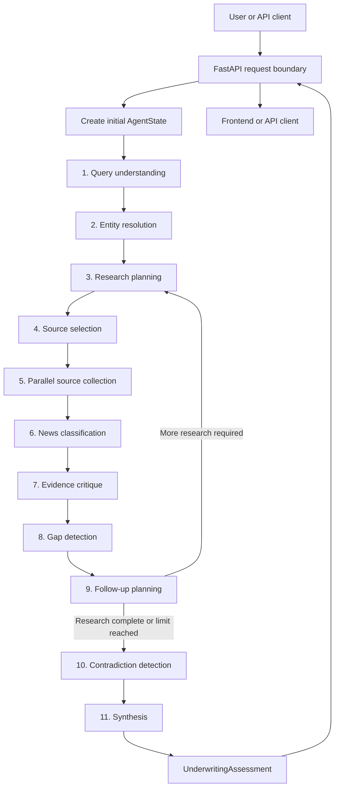
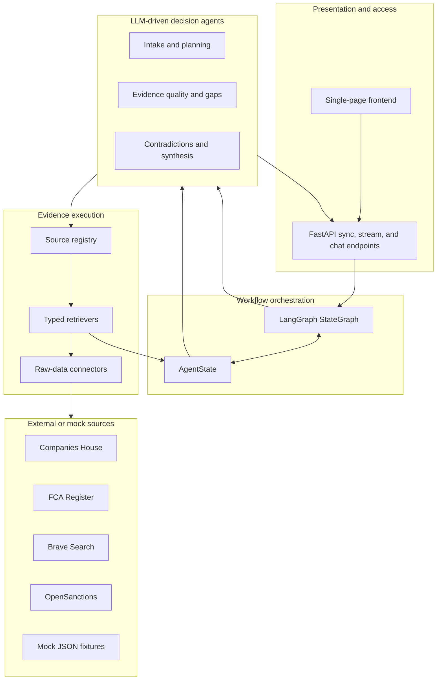
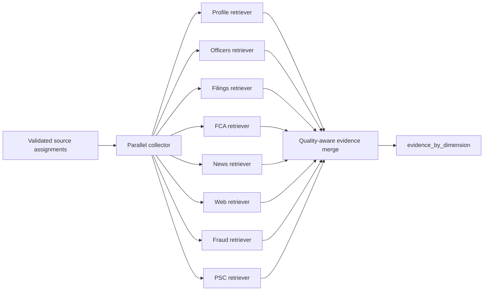
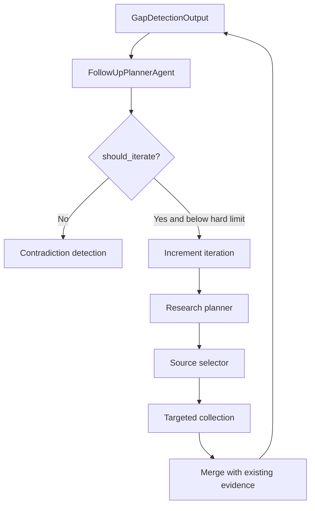
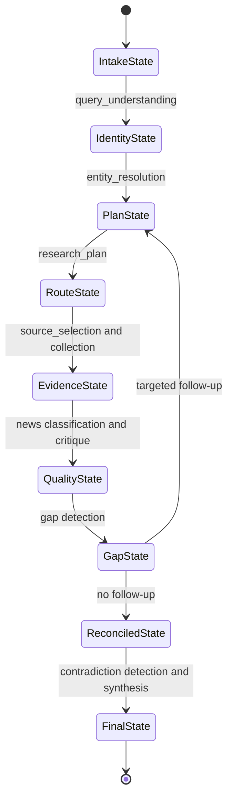
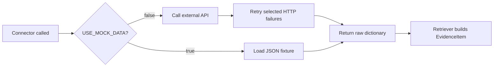
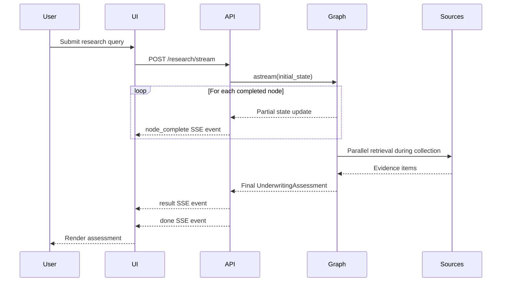

# Operational Flow and System Segregation

## UK Company Due Diligence and Risk Intelligence Agent

Document date: 2026-06-14

## 1. Purpose of this document

This document explains how the system operates from the moment a user submits a
company research request until the system returns an insurance underwriting
assessment.

It focuses on four questions:

1. What happens at each operational stage?
2. Why does that stage exist?
3. How are responsibilities separated between agents, retrievers, connectors,
   schemas, and the API?
4. Where does the current implementation fall short of the intended operating
   model?

The system is not designed as a general chatbot. It is a directed research
workflow in which each stage produces a typed operational artifact for the next
stage.

## 2. Operational objective

The primary operational objective is to turn a natural-language request such as:

> Create an underwriting risk assessment for Example Limited.

into a structured evidence-backed assessment that helps an underwriter decide
whether a risk can be quoted, needs human referral, or contains potential
decline indicators.

The system currently produces:

- resolved company identity;
- evidence across up to eight research dimensions;
- evidence quality and gap assessments;
- contradiction findings;
- a five-part risk matrix;
- key risk flags;
- referral triggers;
- coverage exclusion suggestions;
- premium loading indicators;
- decline indicators;
- confidence and evidence trace information.

It does not currently produce one authoritative `quote`, `refer`, or `decline`
decision field. Instead, it provides the indicators an underwriter would use to
make that decision.

## 3. End-to-end operating flow



The flow is intentionally split into planning, evidence acquisition, evidence
control, and underwriting interpretation. This prevents a single model call
from simultaneously deciding what to research, inventing source data, and
making the final risk judgement.

## 4. Why the workflow is segregated

### 4.1 Decision-making is separated from data access

LLM-driven agents decide:

- what the user is asking;
- which dimensions need investigation;
- which compatible source route should be used;
- whether evidence is sufficient;
- whether follow-up work is needed;
- whether sources contradict each other;
- how the collected evidence should be interpreted for underwriting.

Connectors do not make those decisions. They only access raw data.

Operational reason:

- source integrations can be tested and replaced independently;
- API failures cannot directly alter underwriting logic;
- LLM prompts cannot directly perform uncontrolled network access;
- the origin of every evidence item remains identifiable.

### 4.2 Raw data access is separated from evidence normalization

Connectors return source-specific dictionaries. Retrievers convert those
dictionaries into the common `EvidenceItem` schema.

Every evidence item contains:

- `source`;
- `dimension`;
- `retrieved_at`;
- `raw_data`;
- `summary`;
- `quality`;
- `confidence`.

Operational reason:

- later agents do not need to understand every external API response shape;
- all dimensions can be assessed through a common evidence contract;
- missing or failed sources can be represented as typed evidence instead of
  crashing the run;
- source-specific data is retained for audit and deterministic fact extraction.

### 4.3 Research quality is separated from risk interpretation

The evidence critic asks:

> Is the evidence complete, authoritative, and usable?

The synthesis agent asks:

> What does the available evidence mean for underwriting?

These are different questions. A high-quality source can contain a serious
adverse fact. Conversely, a low-quality source may contain no adverse facts but
still be inadequate for making a decision.

### 4.4 LLM analysis is separated from authoritative fact transfer

The synthesis LLM produces narrative summaries, risk judgements, and insurance
recommendations. Structured adverse facts such as sanctions hits,
disqualified officers, phoenix evidence, enforcement actions, PSC flags, and
classified news signals are copied directly from the evidence store into the
final assessment.

Operational reason:

- authoritative facts do not depend on the LLM remembering to repeat them;
- raw identifiers and timestamps stay outside the synthesis model contract;
- the final assessment preserves an evidence trail even if the narrative is
  incomplete.

## 5. Layered architecture



### Responsibility boundaries

| Layer | Owns | Must not own |
|---|---|---|
| Frontend | Request submission, progress display, assessment presentation | Research or risk logic |
| API | Input validation, graph invocation, SSE progress, response serialization | Evidence or underwriting decisions |
| LangGraph | Node order, loop routing, shared state progression | Source-specific business logic |
| Agents | Typed LLM decisions and state updates | Raw HTTP implementation |
| Source registry | Valid dimension-to-connector routes | Underwriting decisions |
| Retrievers | Source normalization into `EvidenceItem` | Research planning |
| Connectors | Raw API/mock access and transport errors | Risk scoring |
| Schemas/state | Contracts and validation | External access |

## 6. Detailed stage-by-stage flow

### Stage 0: Request entry

Entry points:

- `POST /research/sync` returns the completed assessment in one response.
- `POST /research/stream` streams node progress using Server-Sent Events and
  then returns the final assessment.
- the CLI invokes the same graph with the same canonical initial state.

Initial state:

```text
user_query
iteration_count = 1
errors = []
evidence_by_dimension = {}
```

Why this exists:

- all entry points start with identical iteration and evidence behavior;
- the graph does not depend on frontend-specific state;
- non-fatal errors can accumulate throughout the run.

### Stage 1: Query understanding

Input:

- the user's natural-language query.

Action:

- a fast LLM parses the company name;
- identifies the research objective;
- selects requested research dimensions;
- broad underwriting requests are expected to include all eight dimensions;
- fraud and beneficial ownership are baseline requirements in the prompt.

Output:

- `QueryUnderstandingOutput`.

Why this exists:

- users do not need to know internal dimension names;
- narrow and broad requests can enter the same graph;
- downstream planning receives structured intent instead of free text.

Failure behavior:

- the error is appended to state;
- there is no typed query-understanding fallback;
- entity resolution falls back to using the original query as a company name.

### Stage 2: Entity resolution

Input:

- parsed company name.

Action:

1. Search Companies House.
2. If one result is found, use its company number.
3. If multiple results are found, ask the LLM to select the best match.
4. Search the FCA Register for a firm reference number.

Output:

- canonical company name;
- Companies House number when resolved;
- FCA firm reference when found;
- resolution method;
- resolution confidence.

Why this exists:

- all later official-record queries need stable identifiers;
- company names alone are ambiguous;
- an FCA reference changes both regulatory research and company context.

Operational control:

- a single Companies House match receives high resolution confidence;
- an unresolved entity is allowed to continue using the name only.

### Stage 3: Research planning

Input:

- query understanding;
- resolved identity;
- gaps and weak dimensions from a prior pass, when present;
- current iteration number.

Action:

- the quality-tier LLM decides which dimensions need investigation;
- first-pass broad assessments should cover all dimensions;
- follow-up passes should focus on missing or weak dimensions;
- fraud signals and beneficial ownership are prompted as mandatory.

Output:

- `ResearchPlanOutput` containing dimensions, rationale, and confidence.

Why this exists:

- not every request should incur the same source and LLM cost;
- follow-up work should target only unresolved areas;
- research scope is explicit and auditable.

Fallback:

- if planning fails, all eight dimensions are selected.

### Stage 4: Source selection

Input:

- planned research dimensions;
- basic company context.

Action:

- a fast LLM maps each requested dimension to one connector;
- code validates every selected route;
- missing or incompatible selections are repaired using the source registry;
- repaired selections have confidence capped at `0.5`.

Output:

- `SourceSelectionOutput`.

Why this exists:

- the planner decides what information is required;
- the selector decides how to obtain it;
- validation prevents an LLM from routing a dimension to an unsupported source.

Important detail:

The selection schema permits one primary connector per dimension. Some primary
routes invoke secondary enrichment connectors internally.

### Stage 5: Parallel source collection

Input:

- validated source assignments;
- company number;
- company name;
- FCA firm reference;
- evidence already collected in earlier passes.

Action:

- each selected retriever is run concurrently with `asyncio.gather`;
- synchronous retrievers run in worker threads through `asyncio.to_thread`;
- each retriever returns one `EvidenceItem`;
- failures become missing evidence instead of terminating the graph;
- new evidence is merged with prior-pass evidence.

Evidence merge precedence:

1. higher evidence quality wins;
2. when quality is equal, higher confidence wins;
3. when both are equal, the newer item wins.

Why this exists:

- independent source calls do not need to wait for one another;
- a slow FCA or web source does not serialize the complete run;
- a weak retry cannot overwrite stronger evidence from a previous pass;
- partial results remain usable when one source fails.



### Stage 6: News classification

Input:

- retrieved news candidates;
- resolved company identity.

Action:

- Brave Search candidates are retrieved across seven search categories;
- candidates are deduplicated and capped;
- one fast structured LLM call classifies every candidate;
- the output assigns category, severity, rationale, and confidence;
- classification IDs must exactly match candidate IDs;
- classified signals are written back into the news evidence item.

Why retrieval and classification are separate:

- search categories are retrieval hints, not final risk decisions;
- a headline returned by a fraud-related query is not automatically fraud;
- keyword rules would confuse mention, allegation, and confirmed events;
- one batch classification call is cheaper and more consistent than one call
  per article.

Failure behavior:

- classification status becomes `failed`;
- news quality is reduced to low;
- confidence is capped at `0.3`;
- the error is recorded;
- later quality stages can trigger follow-up.

### Stage 7: Evidence critique

Input:

- planned dimensions;
- compact summaries and quality labels for collected evidence.

Action:

- the quality-tier LLM grades each dimension as high, medium, low, or missing;
- produces an overall quality score;
- identifies weak dimensions;
- fraud and regulatory evidence are prompted as more important than
  supplementary web evidence.

Output:

- `EvidenceCritiqueOutput`.

Why this exists:

- successful HTTP retrieval does not mean the evidence is sufficient;
- source authority, completeness, and recency need separate assessment;
- the workflow needs a quality control gate before synthesis.

### Stage 8: Gap detection

Input:

- planned dimensions;
- evidence quality by dimension;
- company context;
- configured confidence threshold.

Action:

- the quality-tier LLM identifies missing dimensions;
- identifies partially covered dimensions;
- emits a `gap_score` from `0.0` to `1.0`;
- indicates whether follow-up is needed.

Why this exists:

- absence of adverse evidence must not be confused with complete research;
- critical checks need another attempt when their evidence is missing;
- follow-up decisions require a structured description of what is unresolved.

### Stage 9: Follow-up planning and loop

Input:

- gap score;
- missing dimensions;
- partially covered dimensions;
- current and maximum iteration counts.

Action:

- a fast LLM decides whether another pass is warranted;
- proposes dimensions to retry and targeted additional queries;
- code enforces the maximum research-pass limit;
- if another pass is approved, `iteration_count` is incremented and the graph
  returns to research planning.



Why this exists:

- the system can improve incomplete research instead of immediately producing
  a low-confidence result;
- retries can be limited to unresolved dimensions;
- the hard cap controls latency, source cost, and infinite-loop risk.

With the default `MAX_FOLLOWUP_ITERATIONS=2`, the system permits:

- pass 1: initial research;
- pass 2: one targeted follow-up pass;
- then it must continue to synthesis.

### Stage 10: Contradiction detection

Input:

- compact summaries from all retained evidence dimensions.

Action:

- the quality-tier LLM compares evidence across sources;
- identifies factual discrepancies;
- names both sources;
- rates contradiction severity;
- fraud, sanctions, and ownership contradictions should be at least high
  severity according to the prompt.

Why this exists:

- official records, regulatory data, news, and public claims can disagree;
- unresolved contradictions should reduce confidence;
- underwriters need discrepancies surfaced rather than silently averaged away.

### Stage 11: Synthesis

Input:

- resolved company identity;
- compact evidence summaries;
- missing dimensions;
- contradictions;
- iteration count.

Action:

- the quality-tier LLM produces `SynthesisAnalysis`;
- code builds the final `UnderwritingAssessment`;
- deterministic evidence projection adds authoritative structured facts;
- all retained `EvidenceItem` records are attached as the evidence trace.

LLM-produced content:

- dimensional narrative summaries;
- key risks;
- risk matrix;
- overall risk level;
- referral triggers;
- exclusions;
- loading indicators;
- decline indicators;
- applicable insurance lines;
- overall confidence and rationale.

Deterministically copied content:

- disqualified officers;
- phoenix risk score and evidence;
- sanctions hits;
- enforcement actions;
- PSC risk flags;
- classified news signals;
- evidence items;
- covered and missing dimensions;
- contradictions;
- iteration count.

Why this split exists:

- the LLM is used for interpretation and narrative judgement;
- authoritative source facts remain source-derived;
- the final response is both readable and auditable.

## 7. Research-dimension segregation

| Dimension | Operational question | Primary route | Secondary footprint | Main evidence produced |
|---|---|---|---|---|
| `company_profile` | Does the legal entity exist and what is its status? | Companies House | None | Name, status, type, incorporation |
| `officers` | Who controls and manages the company? | Companies House | None | Active and resigned officers |
| `filing_history` | Is the company maintaining expected statutory filings? | Companies House | None | Filing count, types, latest filing |
| `regulatory_status` | Is the firm authorised and has it faced regulatory action? | FCA Register | None | Status, FRN, permissions, disciplinary history |
| `news_signals` | Are there recent adverse or material public events? | Brave Search | Seven category searches | Typed news candidates and classifications |
| `web_evidence` | Is there supplementary public evidence? | Web Evidence | Brave Search | Search snippets and supporting context |
| `fraud_signals` | Are there disqualification, phoenix, or sanctions indicators? | Companies House Fraud | OpenSanctions | Officer checks, phoenix score, sanctions |
| `beneficial_ownership` | Who ultimately controls the entity and are there opacity or PEP risks? | Companies House PSC | OpenSanctions | PSC structure, control, jurisdiction and sanctions flags |

### Why dimensions are separate

Each dimension answers a different operational risk question and has a different
source authority:

- Companies House establishes legal and statutory facts.
- FCA data establishes regulated status.
- Brave Search provides current but less authoritative public signals.
- OpenSanctions provides financial-crime screening enrichment.
- PSC data establishes control and ownership structure.

Keeping dimensions separate prevents a large volume of weak web evidence from
masking a missing authoritative source.

## 8. State progression

`AgentState` is the operational record of one research run. Nodes do not mutate
it in place. Each node returns a partial dictionary of updates.



Important state groups:

| State group | Fields |
|---|---|
| Input | `user_query` |
| Intent | `query_understanding` |
| Identity | `entity_resolution` |
| Plan and routes | `research_plan`, `source_selection` |
| Evidence | `evidence_by_dimension`, pass footprint, news classification |
| Quality | `evidence_critique` |
| Follow-up | `gap_detection`, `followup_plan`, `iteration_count` |
| Reconciliation | `contradiction_detection` |
| Output | `due_diligence_brief` |
| Operational errors | `errors` |

## 9. Live mode and mock mode

All connectors inherit the `USE_MOCK_DATA` setting.



Mock mode exists to support:

- repeatable local development;
- tests without network access;
- demos without paid API keys;
- deterministic connector behavior.

Live mode uses:

- request timeouts;
- retries for `429`, `500`, `502`, `503`, and `504`;
- connector-specific authentication;
- typed missing evidence when a route fails.

Mock evidence proves pipeline behavior. It does not prove that live source
availability, entity matching, freshness, or real-world underwriting accuracy
is acceptable.

## 10. API and frontend operational flow

### Streaming request



The streamed node details are presentation summaries only. They do not change
the state or the research decisions.

### Follow-up chat

The follow-up chat endpoint does not rerun the research graph. It receives the
previous assessment and asks one LLM to answer using that assessment as its sole
context.

Operational implication:

- chat is fast and inexpensive;
- chat cannot retrieve new evidence;
- chat cannot repair a weak research run;
- a question requiring new facts must start a new research request.

## 11. Failure handling

The workflow is designed to degrade into visible missing evidence rather than
fail the complete run whenever possible.

| Failure location | Current behavior |
|---|---|
| Connector HTTP failure | Converted to `ConnectorError` |
| Retriever failure | Returns missing evidence with confidence `0.0` |
| One parallel route fails | Other routes continue |
| Planning LLM fails | Research planner falls back to all dimensions |
| Source selector LLM fails | Default route mapping is used |
| Evidence critic fails | Quality is derived from retained evidence labels |
| Gap detector fails | No follow-up is requested |
| Follow-up planner fails | Research continues without another pass |
| Contradiction detector fails | Empty contradiction result with low confidence |
| News classification fails | News evidence becomes low quality |
| Synthesis fails | Minimal low-confidence assessment is returned |

Errors are accumulated in `state["errors"]` and returned through the API.

Operational trade-off:

- availability is prioritised over all-or-nothing completion;
- operators must inspect missing dimensions and errors before relying on a
  low-error-looking final assessment.

## 12. Current confidence and risk behavior

The final overall confidence is currently selected by the synthesis LLM from
prompted bands. It is not calculated by averaging retriever confidence,
evidence quality score, and gap score.

The final overall risk level is also an LLM output. There is no explicit
aggregation rule that converts the five risk-matrix dimensions and adverse
facts into the overall level.

This explains why outputs can cluster around:

- `0.70` overall confidence;
- `medium` overall risk.

Operational consequence:

- the values are useful as model judgements;
- they are not yet calibrated scoring controls;
- they should not be treated as actuarial or policy-rule outputs.

## 13. Current implementation shortfalls

### 13.1 Follow-up queries are generated but not executed

`FollowUpPlanOutput` can contain targeted `additional_queries`, but the
retrievers currently receive only company identifiers. The additional query
text is not passed into the next collection pass.

Current effect:

- follow-up can retry dimensions;
- it cannot yet change the search strategy using the proposed targeted query.

### 13.2 Gap threshold routing is partly prompt-controlled

The follow-up prompt tells the LLM not to iterate below the confidence
threshold. Code enforces the maximum iteration count, but the graph's
conditional edge primarily checks the LLM's `should_iterate` decision.

Current effect:

- the hard loop limit is deterministic;
- the threshold exit is not independently recalculated at the graph boundary.

### 13.3 Evidence quality score is not used in final confidence

The evidence critic produces `overall_quality_score`, and the gap detector
produces `gap_score`, but synthesis receives only compact evidence summaries,
missing dimensions, and contradictions.

Current effect:

- final confidence is not a traceable numerical aggregation;
- two similar runs may receive the same rounded confidence for different
  reasons.

### 13.4 Overall risk aggregation is not explicit

The synthesis prompt explains how to score each risk-matrix dimension but does
not define how those dimensions combine into `overall_risk_level`.

Current effect:

- the LLM often selects the middle category;
- serious structured facts do not programmatically force a high or critical
  overall level.

### 13.5 Missing risk evidence defaults to low in the risk matrix

Unknown or unsupported risk-matrix values are coerced to `low`, and the prompt
also asks the model to default missing dimensions to low.

Current effect:

- missing evidence can appear similar to affirmative low risk;
- evidence sufficiency and risk severity are not fully separated in the final
  matrix.

### 13.6 Synthesis receives compressed evidence

Evidence summaries are truncated before being sent to evidence-control and
synthesis agents.

Current effect:

- token usage is controlled;
- subtle details present only in `raw_data` may not influence the LLM;
- selected adverse facts are protected by deterministic projection, but not
  every source fact is.

### 13.7 Entity resolution can continue when identity is uncertain

An unresolved company number does not stop the graph.

Current effect:

- open-web and name-based research may still proceed;
- official company-number-dependent sources may return weak or incorrect
  evidence;
- there is no human confirmation gate for ambiguous high-impact cases.

### 13.8 One primary route is selected per dimension

The source selector returns one connector for each dimension. Composite
retrievers can use secondary enrichment sources, but the graph does not retain
multiple independent evidence items for the same dimension.

Current effect:

- the model is operationally simple;
- source diversity and independent corroboration within a dimension are
  limited;
- the evidence store keeps the preferred item, not a full source history.

### 13.9 Parallelism uses one collector node

The project guidance describes LangGraph `Send` fan-out. The implemented graph
uses one async collector node with `asyncio.gather` and worker threads.

Current effect:

- source calls do execute concurrently;
- LangGraph sees collection as one node rather than separate observable source
  branches;
- per-source checkpointing and graph-level retries are limited.

### 13.10 No final underwriting disposition field

The output contains referral, loading, exclusion, and decline indicators, but
not one controlled disposition.

Current effect:

- a human can interpret the assessment;
- downstream systems cannot reliably consume a single `quote`, `refer`, or
  `decline` status.

## 14. Operational controls already present

| Control | Purpose |
|---|---|
| Pydantic structured outputs | Prevent malformed agent outputs |
| Source registry validation | Prevent unsupported connector routing |
| Mock-first connectors | Support deterministic testing |
| HTTP retry and timeout | Reduce transient source failures |
| Parallel collection | Reduce end-to-end latency |
| Evidence merge precedence | Preserve stronger prior evidence |
| Exact news ID validation | Prevent classifications being attached to the wrong article |
| Maximum follow-up iterations | Prevent unbounded loops |
| Error accumulation | Preserve non-fatal operational failures |
| Deterministic fact projection | Preserve authoritative adverse facts |
| Evidence trace in final output | Support review and audit |
| Provider-agnostic LLM factory | Allow model/provider switching through configuration |

## 15. Recommended operational interpretation

Until confidence and overall risk are calibrated, an operator should read the
assessment in this order:

1. Confirm resolved company name and number.
2. Review errors and missing dimensions.
3. Review sanctions, disqualification, enforcement, phoenix, and PSC facts.
4. Review contradictions.
5. Review source quality and evidence trace.
6. Review risk matrix and key risks.
7. Review referral and decline indicators.
8. Treat overall confidence and risk as synthesis summaries, not as independent
   proof.

This order prevents a simple `medium / 70%` headline from hiding identity,
coverage, or adverse-fact issues.

## 16. Suggested next operational improvements

The next improvements should preserve the existing segregation:

1. Add an explicit confidence breakdown based on coverage, quality,
   contradictions, critical-dimension completeness, and source reliability.
2. Add an explicit overall-risk aggregation rubric with a typed rationale.
3. Represent `unknown` or `insufficient_evidence` separately from low risk.
4. Pass targeted follow-up queries into compatible retrievers.
5. Enforce the gap threshold at the graph boundary as well as in the prompt.
6. Add an entity-resolution confirmation gate below a configured confidence.
7. Retain multiple source observations per dimension when corroboration matters.
8. Add a controlled underwriting disposition schema for `quote`, `refer`, or
   `decline`, with evidence-backed reasons.
9. Expose per-stage latency, source failures, token use, and iteration counts as
   operational metrics.
10. Add real-company calibration tests before treating scores as production
    controls.

## 17. Code map

| Concern | Main implementation |
|---|---|
| Graph topology | `src/graph.py` |
| Shared workflow state | `src/state.py` |
| Typed contracts | `src/schemas.py` |
| Prompts and decision rubrics | `src/prompts.py` |
| LLM provider and tiers | `src/llm.py` |
| Source route validation | `src/source_registry.py` |
| Parallel collection | `src/agents/parallel_source_collector.py` |
| Evidence merging | `src/evidence_merge.py` |
| Raw source access | `src/connectors/` |
| Evidence normalization | `src/retrievers/` |
| Evidence control agents | `src/agents/evidence_critic.py`, `gap_detector.py`, `contradiction_detector.py` |
| Final assessment assembly | `src/agents/synthesis_agent.py` |
| Authoritative fact projection | `src/evidence_facts.py`, `src/news_facts.py` |
| API and SSE progress | `src/api/routes.py` |
| Frontend presentation | `frontend/index.html` |

## 18. Summary

Operationally, the system works as a controlled research pipeline:

```text
Understand the request
-> resolve the legal entity
-> plan research dimensions
-> select compatible sources
-> collect and normalize evidence in parallel
-> classify source material
-> assess evidence quality
-> identify gaps and retry when justified
-> reconcile contradictions
-> synthesize an underwriting assessment
-> preserve the evidence trace
```

The segregation is sound in principle: decisions, data access, evidence
normalization, quality control, and final interpretation have distinct owners.
The primary remaining weakness is not the flow itself. It is the calibration
and enforcement of the final confidence, overall risk, follow-up query, and
underwriting disposition controls.
